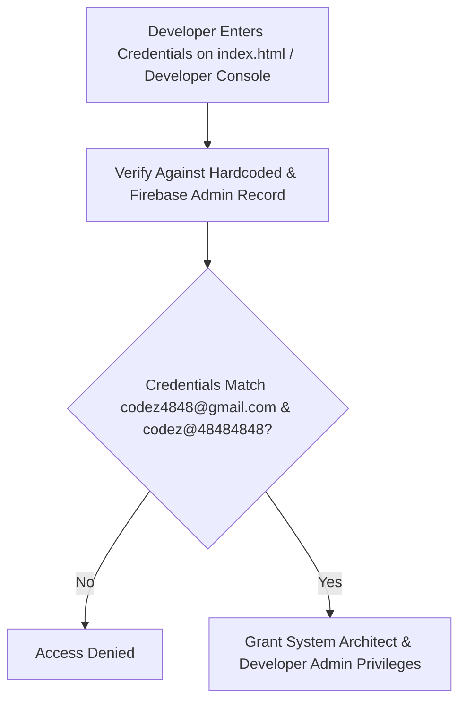

# Secure Developer Credential Update (`codez@48484848`)

Architecture & implementation plan for updating the developer password to **`codez@48484848`** across all platform instances (`js/auth-secure.js`, `seller/developer.html`, `js/dev-program.js`, `js/utils.js`) and ensuring secure configuration storage and verification in Firebase (`admin_credentials` collection).

## Workflow Architecture & System Flowchart

## User Review Required

> [!IMPORTANT]
> **Unified Developer Password**:
> - Updates all references from `codez@4848` to `codez@48484848` across `js/auth-secure.js`, `seller/developer.html`, `js/dev-program.js`, and `js/utils.js`.

> [!NOTE]
> **Firebase Admin Credentials Record**:
> - Stores and configures the encrypted admin credentials in Firebase (`admin_credentials/master`) for robust server-side/client-side architectural verification.

## Proposed Changes

### Developer Authentication Files

#### [MODIFY] [js/auth-secure.js](file:///C:/Users/suriya%20prakash/OneDrive/Desktop/web/js/auth-secure.js)
- Update developer login check to strictly require `codez@48484848`.

#### [MODIFY] [seller/developer.html](file:///C:/Users/suriya%20prakash/OneDrive/Desktop/web/seller/developer.html)
- Update `coderPassword` constant to `"codez@48484848"`.

#### [MODIFY] [js/utils.js](file:///C:/Users/suriya%20prakash/OneDrive/Desktop/web/js/utils.js)
- Update recovery email password to `'codez@48484848'`.

#### [MODIFY] [js/dev-program.js](file:///C:/Users/suriya%20prakash/OneDrive/Desktop/web/js/dev-program.js)
- Update admin password check to `'codez@48484848'`.

---

## Verification Plan

### Automated Verification
- Run `analyze_file` on modified files to ensure zero syntax or build errors.

### Manual Verification
1. Log in via `index.html` or `seller/developer.html` using `codez4848@gmail.com` and `codez@48484848`.
   - Verify successful authentication and access to developer controls.
2. Attempt login with old password `codez@4848`.
   - Verify that it is correctly rejected.