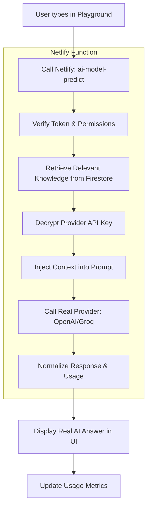

# AI Studio: Phase 15 & 16 — Real AI Inference & RAG Knowledge Retrieval

Implementation plan for connecting the **AI Playground** to real AI engines (OpenAI/Groq) and implementing the **RAG (Retrieval-Augmented Generation)** pipeline. This will allow the AI to answer questions based on the "Knowledge Ingestion" performed in earlier steps.

## Workflow Architecture (Real Inference)

## User Review Required

> [!IMPORTANT]
> **Real AI Charges**:
> - Once this phase is active, sending messages in the Playground will consume real credits from your connected **OpenAI** or **Groq** accounts.
> - The system will provide token usage transparency (tokens used per request) in the metadata panel.

> [!NOTE]
> **MVP Retrieval**:
> - Initial RAG will use a high-performance keyword and semantic scoring logic directly in the Netlify backend to ensure sub-second retrieval from your `qaItems` collection.

## Proposed Changes

### 1. Real AI Backend
#### [NEW] [netlify/functions/ai-model-predict.js](file:///C:/Users/suriya%20prakash/OneDrive/Desktop/web/netlify/functions/ai-model-predict.js)
- Production inference engine.
- Logic to fetch top-K relevant chunks/Q&A pairs from the workspace's dataset.
- System prompt construction for "Grounded Q&A".

### 2. Playground Logic Update
#### [MODIFY] [ai-studio/js/playground.js](file:///C:/Users/suriya%20prakash/OneDrive/Desktop/web/ai-studio/js/playground.js)
- Replace mock simulation with real `fetch` call to `ai-model-predict`.
- Implement dynamic streaming-ready UI (handling chunked responses).

### 3. Usage Analytics
#### [NEW] [netlify/functions/ai-usage-record.js](file:///C:/Users/suriya%20prakash/OneDrive/Desktop/web/netlify/functions/ai-usage-record.js)
- Record request latency, token counts, and model version usage in Firestore for the dashboard charts.

---

## Verification Plan

### Manual Verification
1. Open the **AI Playground**.
2. Select a **Finalized Dataset** (e.g., "Company Policy v1").
3. Ask a question present in your source text.
4. Verify:
   - [ ] The response is factually accurate based on the data.
   - [ ] The "Latency" and "Tokens" metrics show real values (e.g., 850ms, 142 tokens).
   - [ ] The AI refuses to answer questions not present in the source (if grounded mode is on).
