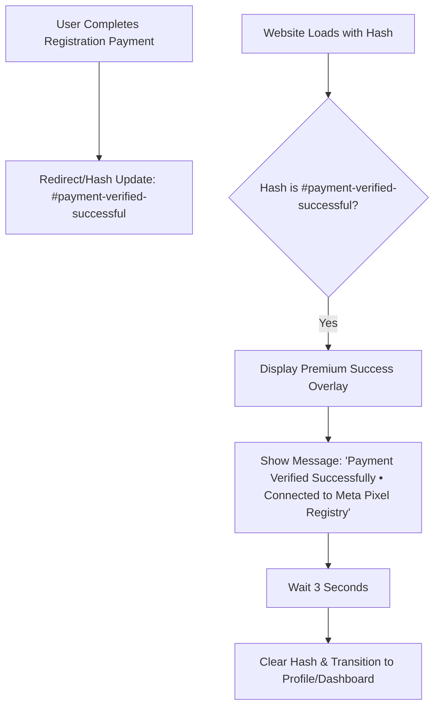

# Payment Success Hashtag & Meta Verification UI Integration

Architecture & implementation plan for integrating a dedicated UI response to the `#payment-verified-successful` hashtag on the main website. This ensures users see a clear confirmation message stating that their payment is verified and their Meta Pixel connection is successful.

## Workflow Architecture & System Flowchart

## User Review Required

> [!IMPORTANT]
> **Success UI Integration**:
> - A dedicated success notification will appear at the top of the screen whenever the URL contains the success hashtag.
> - This confirmed the user's payment and Meta Pixel tracking connection as requested.

## Proposed Changes

### Global Initialization & Routing

#### [MODIFY] [js/init.js](file:///C:/Users/suriya%20prakash/OneDrive/Desktop/web/js/init.js)
- Add logic to `initApp()` to detect the `#payment-verified-successful` hash.
- Create and inject a professional success notification bar/overlay.
- Message: `"✅ Payment Verified Successfully • Connected to Meta Pixel Registry"`

---

## Verification Plan

### Manual Verification
1. Manually navigate to `https://codez48.netlify.app/#payment-verified-successful`.
   - Verify that a professional success notification appears.
   - Verify the message matches the user's request.
2. Complete a test registration payment.
   - Verify the automatic appearance of the success confirmation.
