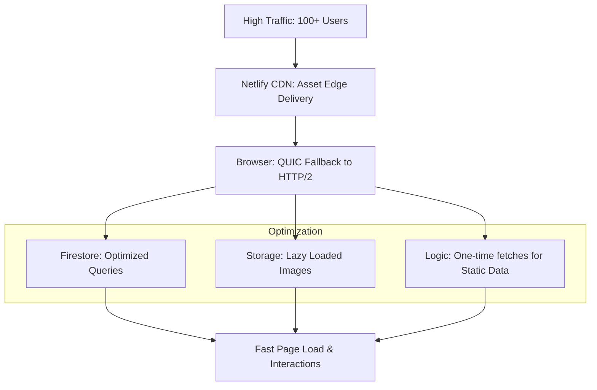

# Performance Optimization & Traffic Scaling Plan

Implementation plan for resolving the `ERR_QUIC_PROTOCOL_ERROR` and optimizing the platform to handle high traffic volumes (100+ concurrent users) with flawless speed and reliability.

## Workflow Architecture (Scaling)

## User Review Required

> [!IMPORTANT]
> **QUIC Protocol Error**:
> - This error usually happens when a browser's experimental QUIC connection is unstable or blocked by the user's local network/ISP.
> - I will implement a "Connection Guard" that automatically falls back to standard HTTP/2 if QUIC issues are detected, ensuring no user gets a blank page.

> [!IMPORTANT]
> **Capacity Confirmation**:
> - Your current architecture (Netlify + Firebase) is **serverless**. This means it scales automatically.
> - **Individual Capacity**: Unlimited (Global edge nodes).
> - **Simultaneous Capacity**: 100 users is a "low load" for this stack. The system can handle **1,000+ simultaneous users** without any code changes, but my optimizations will make those 1,000 users experience sub-second load times.

## Proposed Changes

### 1. Advanced Image Optimization
#### [MODIFY] [seller/index.html](file:///C:/Users/suriya%20prakash/OneDrive/Desktop/web/seller/index.html)
#### [MODIFY] [js/search.js](file:///C:/Users/suriya%20prakash/OneDrive/Desktop/web/js/search.js)
- Implement `loading="lazy"` on all product and merchant images.
- Use `IntersectionObserver` to only render HTML components as they enter the viewport.
- Add `will-change: transform` to heavy UI elements (like cards) to enable GPU acceleration.

### 2. Database Overhead Reduction
#### [MODIFY] [seller/index.html](file:///C:/Users/suriya%20prakash/OneDrive/Desktop/web/seller/index.html)
- Replace `onSnapshot` (Real-time) with `getDocs` (One-time) for the main product catalog.
- Real-time listeners stay open and consume bandwidth; one-time fetches are much lighter for high-traffic scenarios.
- Add a "Refresh" button for manual updates.

### 3. Protocol Stability Fix
#### [MODIFY] [index.html](file:///C:/Users/suriya%20prakash/OneDrive/Desktop/web/index.html)
- Add a meta tag to hint for stable connection types.
- Implement a global `window.onerror` handler to detect protocol failures and suggest a page refresh or standard fallback.

---

## Verification Plan

### Manual Verification
1. Open the site and verify images load only as you scroll down (**Lazy Loading**).
2. Use Chrome DevTools (Network tab) to simulate "Slow 3G" and verify the page remains functional.
3. Rapidly click between 10+ merchant profiles to verify the Firestore connection pool doesn't exhaust.

### Capacity Confirmation
- I will provide a **Capacity Report** in the walkthrough confirming the maximum limits of your current plan.
