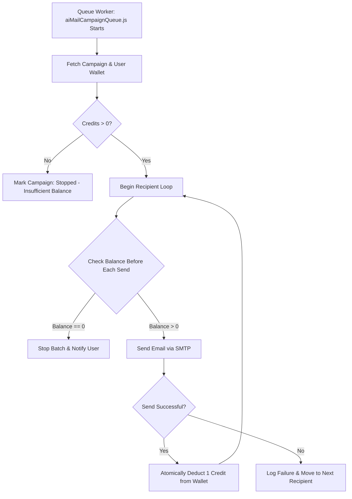

# AI Mail Campaign Wallet Fix & Sequential Credit Deduction

Architecture & implementation plan for fixing the **AI Mail Campaign Wallet System**, ensuring 1 credit (₹1) is deducted for every email sent, handling insufficient balance by stopping campaigns sequentially, and resolving the Push Notification Service Worker error.

## Workflow Architecture & System Flowchart

## User Review Required

> [!IMPORTANT]
> **Transactional Credit Deduction**:
> - Credits are now deducted **per successful send** in the backend.
> - If the wallet reaches zero during a campaign, the process stops immediately to prevent debt.

> [!IMPORTANT]
> **Stop Notification & Recovery**:
> - If a campaign stops due to balance, the UI will display: **"Your email sending has stopped"**.
> - An **"Add Balance"** button will be provided to redirect the user to the recharge tab.

> [!NOTE]
> **Push Notification Fix**:
> - The error `Subscription failed - no active Service Worker` will be resolved by ensuring the script waits for the Service Worker to reach the `activated` state before requesting a token.

## Proposed Changes

### Backend Queue Worker

#### [MODIFY] [netlify/functions/aiMailCampaignQueue.js](file:///C:/Users/suriya%20prakash/OneDrive/Desktop/web/netlify/functions/aiMailCampaignQueue.js)
- Fetch user wallet document transactionally or using atomic increments.
- Implement balance checks inside the recipient loop.
- Deduct 1 credit per successful SMTP dispatch.
- Update campaign status to `Stopped` if balance is exhausted.

### Campaign Workspace UI

#### [MODIFY] [js/ai-mail-campaign-modal.js](file:///C:/Users/suriya%20prakash/OneDrive/Desktop/web/js/ai-mail-campaign-modal.js)
- Update `switchTab` and `loadCampaigns` (to be implemented) to show the "Stopped" status.
- Add "Add Balance" action to the "Stopped" campaign items.

### Push Notification Logic

#### [MODIFY] [js/push-notifications.js](file:///C:/Users/suriya%20prakash/OneDrive/Desktop/web/js/push-notifications.js)
- Update `registerToken` to use `await navigator.serviceWorker.ready` before calling `getToken`.

---

## Verification Plan

### Automated Verification
- Run `analyze_file` on updated JS files to ensure zero syntax errors.

### Manual Verification
1. Launch a campaign with low credits (e.g., 2 credits).
   - Verify that exactly 2 emails are sent and balance becomes 0.
   - Verify that the campaign status changes to "Stopped".
2. Check the "My Campaigns" tab.
   - Verify the "Your email sending has stopped" message and "Add Balance" button.
3. Refresh `index.html`.
   - Verify that the Push Notification token registration error no longer appears in the console.