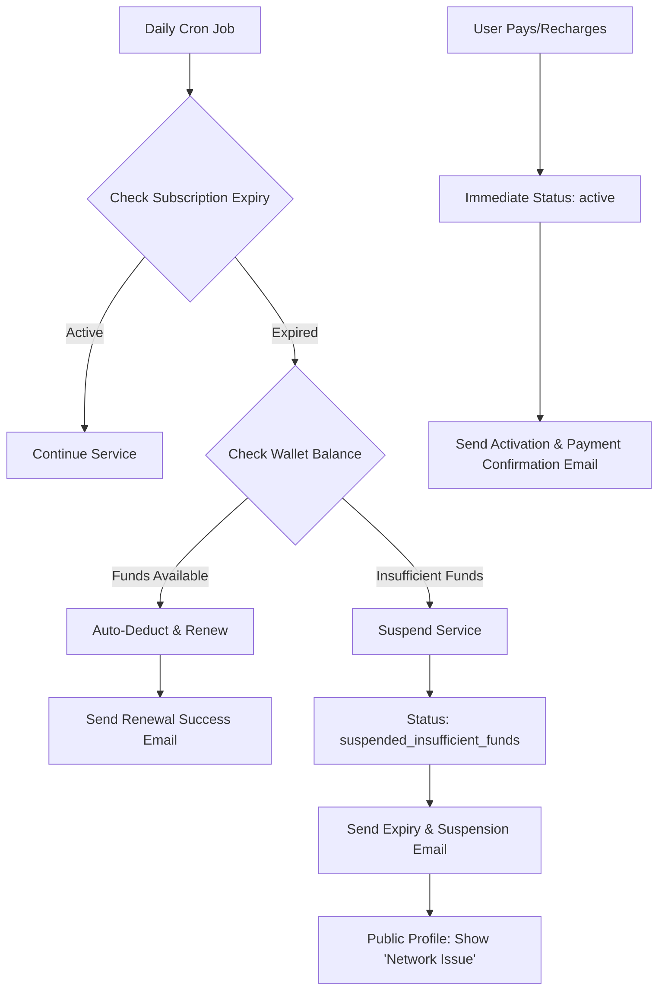

# Subscription Lifecycle & Automated Recovery Integration

Implementation plan for automated subscription expiration notifications, auto-renewal from wallet, and service suspension UI for the CODEZ48 network.

## Workflow Architecture (Subscription Management)

## User Review Required

> [!IMPORTANT]
> **Service Interruption Display**:
> - When a seller's account is suspended, their public profile will now display a professional **"Network Issue"** error screen instead of their products.
> - This protects the user's brand by indicating a technical connection issue rather than a payment failure.

> [!NOTE]
> **Auto-Renewal Threshold**:
> - Auto-renewal for Elite Nodes will trigger at ₹4,000.
> - Auto-renewal for Pro API keys will trigger at ₹99.
> - Notifications will include a direct link to the billing dashboard.

## Proposed Changes

### 1. Backend Automation (Cron & Webhooks)
#### [MODIFY] [netlify/functions/daily-email-cron.js](file:///C:/Users/suriya%20prakash/OneDrive/Desktop/web/netlify/functions/daily-email-cron.js)
- Implement monthly subscription check logic for both `api_keys` and `sellers`.
- Add auto-deduction logic from `walletBalance`.
- Implement "Subscription Expired" email dispatch with direct billing links.

#### [NEW] [netlify/functions/subscriptionExpiredTemplate.js](file:///C:/Users/suriya%20prakash/OneDrive/Desktop/web/netlify/functions/subscriptionExpiredTemplate.js)
- Professional black-themed email template for expiration notices and renewal confirmations.

### 2. Service Interruption UI
#### [MODIFY] [js/profile.js](file:///C:/Users/suriya%20prakash/OneDrive/Desktop/web/js/profile.js)
- Update `showPublicProfile` to detect suspension status.
- Render the **"Network Issue / Service Interruption"** overlay for inactive sellers.

### 3. Subscription & Billing UX
#### [MODIFY] [js/api-key-manager.js](file:///C:/Users/suriya%20prakash/OneDrive/Desktop/web/js/api-key-manager.js)
- Ensure `expiresAt` is correctly saved during purchase.
- Highlight "Zero Balance" in the UI with a prompt to recharge.

#### [MODIFY] [seller/developer.html](file:///C:/Users/suriya%20prakash/OneDrive/Desktop/web/seller/developer.html)
- Update Elite subscription logic to include `subscriptionExpiresAt`.

---

## Verification Plan

### Manual Verification
1. Manually set a seller's `subscriptionExpiresAt` to a past date in Firestore.
2. Trigger the `daily-email-cron` function.
3. Verify:
   - [ ] Wallet is deducted (if balance > threshold).
   - [ ] Email is received with a direct billing link.
   - [ ] Public profile shows "Network Issue" if balance was insufficient.
4. Complete a test payment and verify instant account activation.
