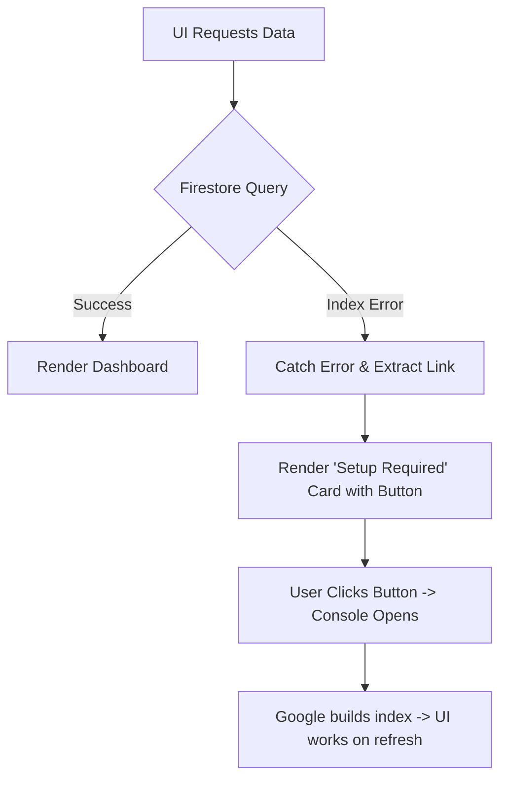

# AI Studio: Indexing Error Resolution & UX Stabilization

Implementation plan for resolving the `FirebaseError: The query requires an index` by providing a one-click indexing fix in the UI and stabilizing the workspace creation feedback loop.

## Workflow Architecture (Error Handling)

## User Review Required

> [!IMPORTANT]
> **Manual Action Required**:
> - The error happens because Firestore needs a "Composite Index" to sort your workspaces by date.
> - I will add a **"Create Firestore Index"** button directly on the blank page. You **MUST** click it and authorize the index in your Firebase Console. It takes 2-3 minutes for Google to finish building it.

> [!NOTE]
> **Workspace Creation**:
> - The reason it looked like "nothing happened" is that the page tried to refresh the list, crashed on the indexing error, and showed a blank screen. The index fix will solve this.

## Proposed Changes

### 1. Global Error Handler
#### [MODIFY] [ai-studio/js/app.js](file:///C:/Users/suriya%20prakash/OneDrive/Desktop/web/ai-studio/js/app.js)
- Add `renderIndexError(container, message)` utility to the `StudioApp` object.
- This will parse the Firebase error for the setup URL and render a professional rose-colored setup card.

### 2. Workspace Registry Stabilization
#### [MODIFY] [ai-studio/js/workspace.js](file:///C:/Users/suriya%20prakash/OneDrive/Desktop/web/ai-studio/js/workspace.js)
- Update `load()` to catch indexing errors and call the global helper.

### 3. Q&A Builder Dropdown Fix
#### [MODIFY] [ai-studio/js/qa-builder.js](file:///C:/Users/suriya%20prakash/OneDrive/Desktop/web/ai-studio/js/qa-builder.js)
- Update `loadWorkspaces()` to show a clear setup notice if the index is missing, preventing the dropdown from being empty.

### 4. Dataset Registry
#### [MODIFY] [ai-studio/js/datasets.js](file:///C:/Users/suriya%20prakash/OneDrive/Desktop/web/ai-studio/js/datasets.js)
- Apply similar error handling for dataset queries.

---

## Verification Plan

### Manual Verification
1. Open **My Workspaces**.
   - Verify that instead of a blank page or generic error, you see a **"Database Setup Required"** card with a link.
2. Click the link and wait for the index to build.
3. Refresh the page.
   - Verify that your workspaces now load correctly.
4. Try creating a new workspace.
   - Verify the success alert appears and the new card is added to the list.
