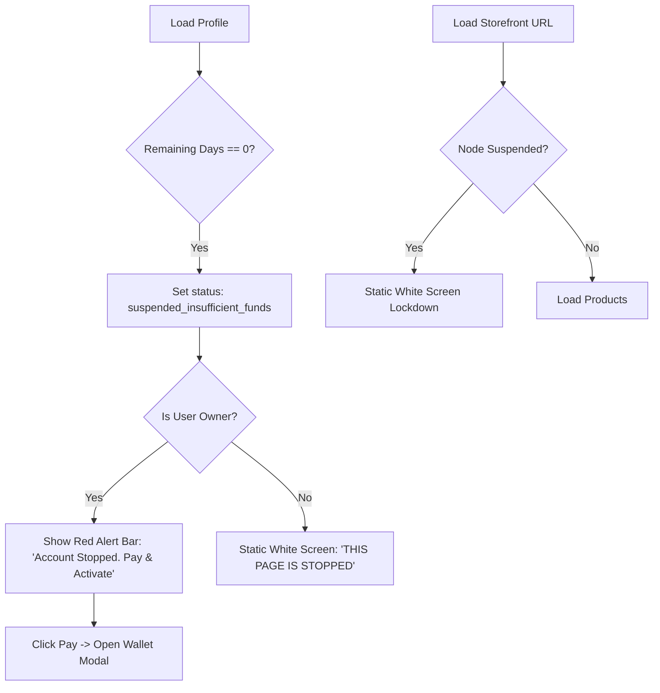

# Expiration Guard & Instant Wallet Payment Integration

Implementation plan for enforcing a high-visibility lockdown when subscription days reach zero, including a "Red Alert Line" on the profile page and direct wallet integration for reactivation.

## Workflow Architecture (Enforcement)

## User Review Required

> [!IMPORTANT]
> **Red Alert Line**:
> - For owners, I will add a high-visibility red banner at the top of the profile content that specifically says: **"YOUR ACCOUNT WAS STOPPED. PAY AND ACTIVATE."**
> - The button in this banner will open the **Merchant Wallet** instantly.

> [!NOTE]
> **Storefront Lockdown**:
> - If any user (public or owner) visits the `seller/index.html` URL while the account is expired, the entire page will be replaced by a white screen with the "THIS PAGE IS STOPPED" message. No product data will be leaked.

## Proposed Changes

### 1. Profile Page Red Alert & Wallet Link
#### [MODIFY] [js/profile.js](file:///C:/Users/suriya%20prakash/OneDrive/Desktop/web/js/profile.js)
- Update `showPublicProfile`:
  - Calculate `remainingDays` live. If `0`, force the `isInactive` UI logic.
  - Implement the **Red Alert Line** at the top of the profile container for owners.
  - Set the "Pay" button to trigger `openMerchantWalletModal(sellerId)`.

### 2. Storefront (Seller Index) Lockdown
#### [MODIFY] [seller/index.html](file:///C:/Users/suriya%20prakash/OneDrive/Desktop/web/seller/index.html)
- Ensure the `isInactive` check is the first thing that happens after the seller data is fetched.
- Replace the current "Something went wrong" message with the exact wording: **"THIS PAGE IS STOPPED"**.

### 3. Subscription Status Sync
#### [MODIFY] [js/navigation.js](file:///C:/Users/suriya%20prakash/OneDrive/Desktop/web/js/navigation.js)
- Update `openNodeSettings`:
  - Ensure the "ledger" view also prominently displays the "Account Stopped" message if days are at zero.

---

## Verification Plan

### Manual Verification
1. Log in to an account and manually set `subscriptionExpiresAt` to a past date in Firestore.
2. Open your **Profile Page**.
   - Verify the **Red Alert Line** is visible at the top.
   - Click **Pay** and verify the **Wallet Modal** opens correctly.
3. Visit the **Website URL** (`seller/index.html?s=...`).
   - Verify the page is a white screen with **"THIS PAGE IS STOPPED"**.
4. Add funds to the wallet.
   - Verify the account reactivates instantly and data reappears.
