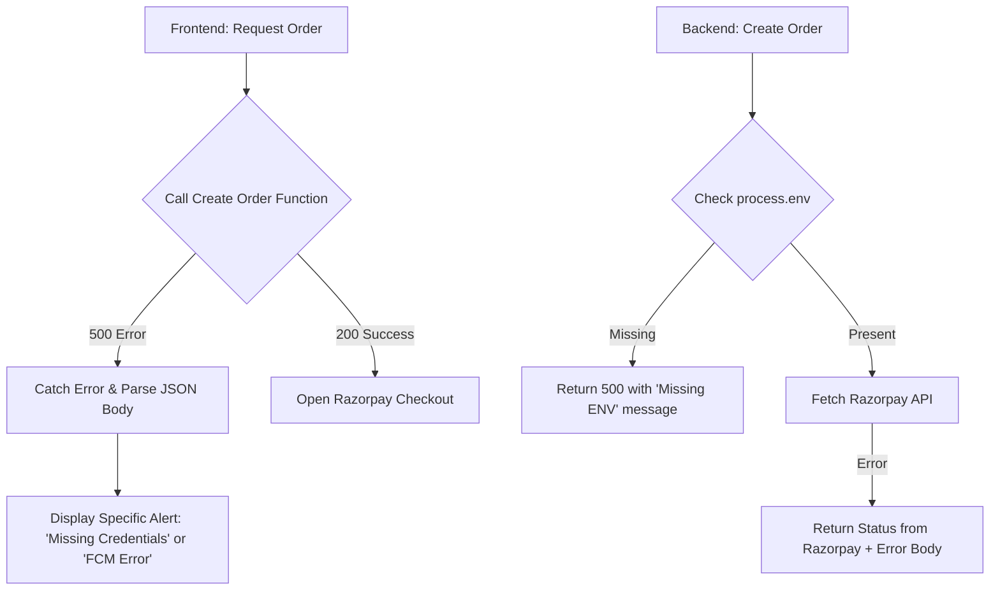

# Razorpay 500 Error Resolution & Enhanced Debugging

Implementation plan for resolving the 500 Internal Server Error in the Razorpay integration and providing clear feedback to identify configuration issues.

## Workflow Architecture

## User Review Required

> [!IMPORTANT]
> **Environment Variables**:
> - The 500 error is most likely caused by missing `RAZORPAY_KEY_ID` or `RAZORPAY_KEY_SECRET` in your Netlify site settings.
> - I will update the code to clearly state if these are missing in the browser alert.

> [!NOTE]
> **Built-in Fetch**:
> - I will switch from `node-fetch` to the built-in `global.fetch` (available in Node 18+) in Netlify functions to eliminate dependency resolution issues that often cause 500 errors.

## Proposed Changes

### 1. Robust Backend Error Handling
#### [MODIFY] [netlify/functions/razorpay-create-order.js](file:///C:/Users/suriya%20prakash/OneDrive/Desktop/web/netlify/functions/razorpay-create-order.js)
- Switch to built-in `fetch`.
- Add detailed logging of environment variable presence (not values).
- Ensure every `try/catch` returns a JSON body with an `error` field.

#### [MODIFY] [netlify/functions/razorpay-verify-payment.js](file:///C:/Users/suriya%20prakash/OneDrive/Desktop/web/netlify/functions/razorpay-verify-payment.js)
- Same improvements as above.

### 2. Informative Frontend Alerts
#### [MODIFY] [js/api-key-manager.js](file:///C:/Users/suriya%20prakash/OneDrive/Desktop/web/js/api-key-manager.js)
- Update `launchRazorpaySubscription()`:
  - If `orderResponse.ok` is false, try to parse `await orderResponse.json()` and show the specific `error` in the alert.

#### [MODIFY] [js/auth-secure.js](file:///C:/Users/suriya%20prakash/OneDrive/Desktop/web/js/auth-secure.js)
- Similar update for registration payments.

#### [MODIFY] [js/ai-mail-campaign-modal.js](file:///C:/Users/suriya%20prakash/OneDrive/Desktop/web/js/ai-mail-campaign-modal.js)
- Similar update for wallet top-ups.

#### [MODIFY] [seller/index.html](file:///C:/Users/suriya%20prakash/OneDrive/Desktop/web/seller/index.html)
- Similar update for storefront orders.

---

## Verification Plan

### Manual Verification
1. Click the "Buy Pro Plan" button in API Keys.
2. If it fails with 500, verify that the alert now says exactly **what** went wrong (e.g., "Razorpay credentials not configured").
3. Once you set the environment variables in Netlify, verify that the 500 error disappears and the Razorpay window opens correctly.
