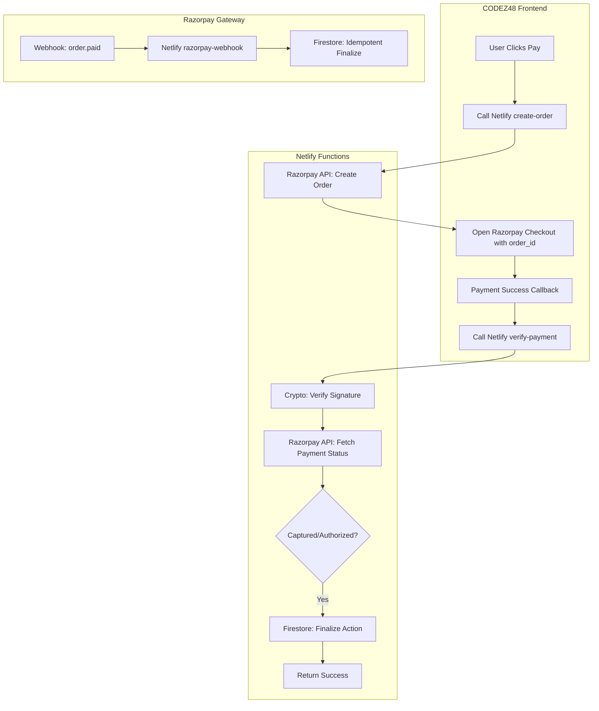

# Razorpay Automatic Refund Fix Implementation Plan

Architecture & implementation plan for resolving the automatic refund issue by upgrading the Razorpay integration to use the **Orders API**, **Server-side Signature Verification**, and **Automatic Payment Capture**.

## Workflow Architecture & System Flowchart

## User Review Required

> [!IMPORTANT]
> **Root Cause Identified**:
> - Current integration does not create a Razorpay `order_id` on the backend.
> - Payments are not being verified or captured on the server-side.
> - Razorpay automatically refunds `authorized` payments (especially UPI) if not `captured` within a short timeout.

> [!IMPORTANT]
> **Credential Security**:
> - Razorpay Key Secret will be moved to Netlify environment variables and removed from frontend files.

## Proposed Changes

### Backend (Netlify Functions)

#### [NEW] [netlify/functions/razorpay-create-order.js](file:///C:/Users/suriya%20prakash/OneDrive/Desktop/web/netlify/functions/razorpay-create-order.js)
- Creates a Razorpay order using `node-fetch`.
- Sets `payment_capture: 1` to ensure automatic capture upon successful authorization.

#### [NEW] [netlify/functions/razorpay-verify-payment.js](file:///C:/Users/suriya%20prakash/OneDrive/Desktop/web/netlify/functions/razorpay-verify-payment.js)
- Verifies `razorpay_signature` using Node.js `crypto`.
- Double-checks payment status with Razorpay API before returning success to frontend.

#### [NEW] [netlify/functions/razorpay-webhook.js](file:///C:/Users/suriya%20prakash/OneDrive/Desktop/web/netlify/functions/razorpay-webhook.js)
- Handles `payment.captured` and `order.paid` events.
- Ensures actions (like adding wallet balance) are performed even if the frontend callback fails.

### Frontend Integration

#### [MODIFY] [js/auth-secure.js](file:///C:/Users/suriya%20prakash/OneDrive/Desktop/web/js/auth-secure.js)
- Update `proceedToPayment()` to fetch `order_id` from the backend.
- Update the Razorpay `handler` to call `verify-payment` function.

#### [MODIFY] [seller/index.html](file:///C:/Users/suriya%20prakash/OneDrive/Desktop/web/seller/index.html)
- Update `processRazorpay()` and `handler` similarly.
- Remove hardcoded `DEFAULT_RAZORPAY_SECRET`.

#### [MODIFY] [js/api-key-manager.js](file:///C:/Users/suriya%20prakash/OneDrive/Desktop/web/js/api-key-manager.js)
- Update `launchRazorpaySubscription()` and `handler` similarly.

#### [MODIFY] [js/ai-mail-campaign-modal.js](file:///C:/Users/suriya%20prakash/OneDrive/Desktop/web/js/ai-mail-campaign-modal.js)
- Update `launchWalletTopUp()` and `handler` similarly.

---

## Verification Plan

### Automated Verification
- Run `analyze_file` on all modified components to ensure syntax and logic integrity.

### Manual Verification
1. Perform a test registration with a small amount (e.g., ₹2).
2. Verify that a Razorpay Order is created in the Razorpay Dashboard.
3. Verify that the payment status changes to `captured` immediately after success.
4. Verify that no automatic refund is initiated after 10 minutes (for UPI).
5. Check backend logs for signature verification success.
