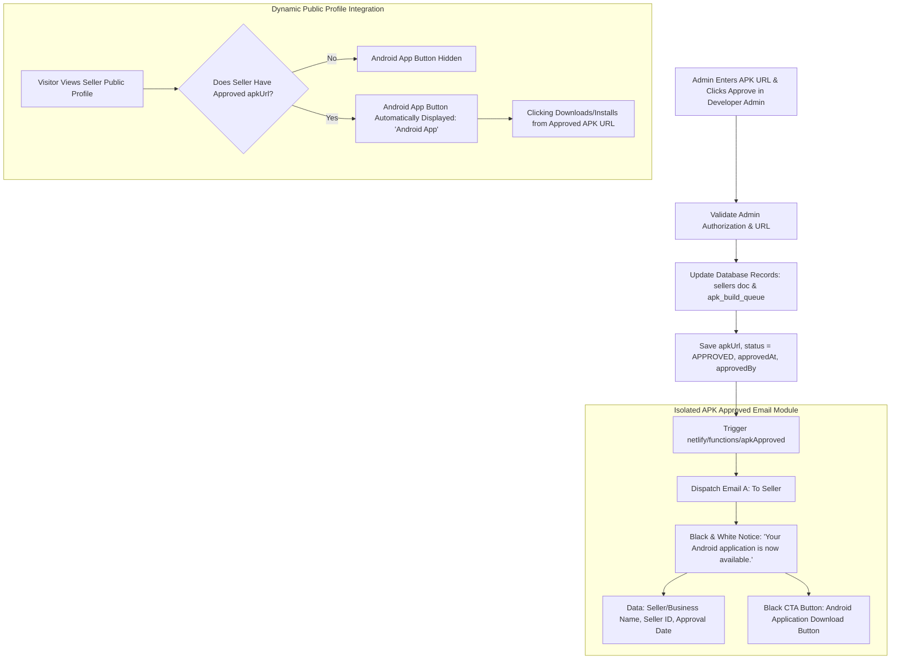

# Separate Email Module for Final APK Approval & Public Profile Button

Architecture & implementation plan for introducing an isolated, dedicated email module handling **APK Approved** events (`APK_APPROVED`) with strict Black & White minimal styling, backend authorization validation, and dynamic public profile Android App download buttons.

## Workflow Architecture & System Flowchart

## User Review Required

> [!IMPORTANT]
> **Isolated Email Module**:
> - Creates `netlify/functions/apkApproved.js` and `netlify/functions/apkApprovedTemplate.js`.
> - **Does not reuse** request or other event handlers.
> - Strictly listens to the `APK_APPROVED` event.

> [!IMPORTANT]
> **Database-First Authorization & State**:
> - Admin authorization and URL validation occur before saving `apkUrl` and status `APPROVED` to both the seller document and `apk_build_queue`.
> - The seller's public profile dynamically displays the "Android App" download button based purely on database state (`seller.apkUrl`), remaining hidden before approval.

> [!NOTE]
> **Black & White Minimalist Email Design**:
> - The seller email uses a white background, black typography, thin black borders, and a black APK download CTA button.

## Proposed Changes

### Developer Admin & Public Profile Controllers

#### [MODIFY] [seller/developer.html](file:///C:/Users/suriya%20prakash/OneDrive/Desktop/web/seller/developer.html)
- Update `approveApkRequest()`:
  - Validate admin authorization and download URL.
  - Update `sellers` document with `apkUrl: url`, `apkStatus: 'APPROVED'`, `approvedAt`, `approvedBy`.
  - Update `apk_build_queue` document with `status: 'APPROVED'`, `approvedAt`, `approvedBy`.
  - Trigger `/.netlify/functions/apkApproved` with payload `{ event: 'APK_APPROVED', ... }`.

#### [MODIFY] [js/profile.js](file:///C:/Users/suriya%20prakash/OneDrive/Desktop/web/js/profile.js)
- Update `showPublicProfile()`:
  - Check if `seller.apkUrl` exists and is approved.
  - If approved, dynamically render the public **"Android App"** download button in the profile action area. If not approved, keep it hidden.

### Isolated Email Handler & Templates

#### [NEW] [netlify/functions/apkApprovedTemplate.js & handler.js](file:///C:/Users/suriya prakash/OneDrive/Desktop/web/netlify/functions/)
- Build `getApkApprovedTemplate(data)` featuring the exact required message, business name, seller ID, approval date, and Android application download button.

---

## Verification Plan

### Automated Verification
- Run `analyze_file` on `seller/developer.html`, `js/profile.js`, `netlify/functions/apkApproved.js`, and `netlify/functions/apkApprovedTemplate.js` to ensure zero syntax or build errors.

### Manual Verification
1. Submit an APK build request as a seller, then log in as Admin/Architect to approve it with a valid URL.
   - Verify that `sellers` and `apk_build_queue` update with `apkUrl`, status = `APPROVED`, `approvedAt`, and `approvedBy`.
   - Verify that the Seller receives the Black & White "Your Android application is now available" email with the download button.
   - Verify that the seller's public profile displays the active "Android App" download button for public visitors.
   - Verify that unapproved profiles do not show the Android App button.