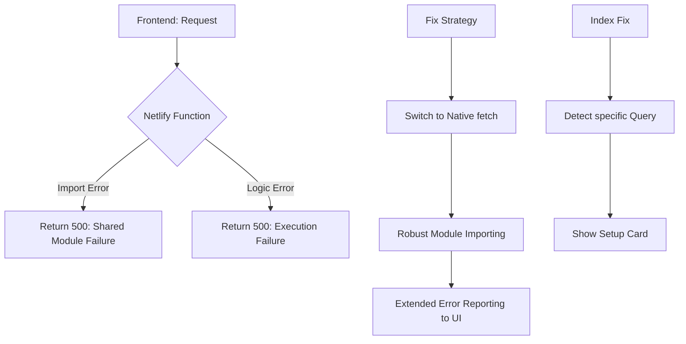

# AI Studio Stability & Functional Restoration Plan

Implementation plan for resolving the `500` Internal Server Errors, fixing the silent failure in workspace creation, and addressing the indexing requirements.

## Workflow Architecture (Stabilization)

## User Review Required

> [!IMPORTANT]
> **Firestore Indexing**:
> - The error message you see in the console provides a link. You **MUST** click that link and create the index in the Firebase Console.
> - I have implemented a "One-Click Fix" button in the UI that will appear whenever an index is missing.

> [!NOTE]
> **Environment Variables**:
> - Please ensure `PROVIDER_KEY_ENCRYPTION_KEY` is set in Netlify (32-character string). If not set, it defaults to a development key, which might cause decryption errors if keys were saved with a different secret.

## Proposed Changes

### 1. Robust Backend Infrastructure
#### [MODIFY] [netlify/functions/_shared/auth.js](file:///C:/Users/suriya%20prakash/OneDrive/Desktop/web/netlify/functions/_shared/auth.js)
#### [MODIFY] [netlify/functions/_shared/crypto.js](file:///C:/Users/suriya%20prakash/OneDrive/Desktop/web/netlify/functions/_shared/crypto.js)
#### [MODIFY] [netlify/functions/_shared/ai-providers/openai-provider.js](file:///C:/Users/suriya%20prakash/OneDrive/Desktop/web/netlify/functions/_shared/ai-providers/openai-provider.js)
#### [MODIFY] [netlify/functions/_shared/ai-providers/groq-provider.js](file:///C:/Users/suriya%20prakash/OneDrive/Desktop/web/netlify/functions/_shared/ai-providers/groq-provider.js)
- Switch all `node-fetch` calls to global `fetch` (native Node.js support).
- Add specific logging for environment variable presence.

### 2. Workspace Creation Reliability
#### [MODIFY] [ai-studio/js/workspace.js](file:///C:/Users/suriya%20prakash/OneDrive/Desktop/web/ai-studio/js/workspace.js)
- Add detailed `console.log` for every state change (Token fetch, Fetch call, Response parse).
- Improve the success feedback loop.

### 3. Comprehensive Error UX
#### [MODIFY] [ai-studio/js/app.js](file:///C:/Users/suriya%20prakash/OneDrive/Desktop/web/ai-studio/js/app.js)
- Global `try/catch` in `switchView`.
- Refined `renderIndexError` to handle different collection types.

---

## Verification Plan

### Manual Verification
1. Open **My Workspaces**.
   - If blank, click the "Create Firestore Index" button.
2. Try creating a workspace.
   - Monitor the console for `[AI WORKSPACE] Success`.
3. Try generating Q&A.
   - If `500` error persists, check the console for the specific backend error message passed through the JSON body.
