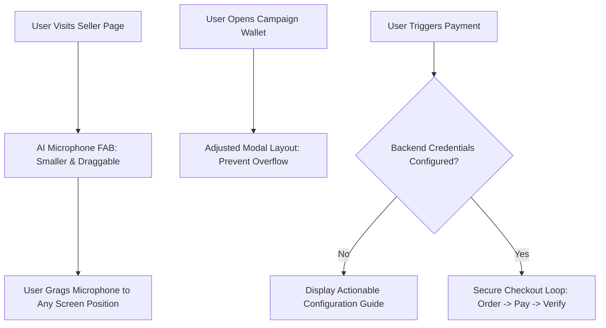

# UI Refinement & Wallet Overflow Fix

Architecture & implementation plan for optimizing the AI Voice Assistant UI on the seller page, fixing layout overflow in the campaign wallet, and providing a final resolution for the Razorpay credential configuration.

## Workflow Architecture & System Flowchart

## User Review Required

> [!IMPORTANT]
> **AI Microphone Upgrade**:
> - Removed all text labels from the microphone element.
> - Reduced overall size to a standard Floating Action Button (FAB) (48x48px).
> - Implemented full mouse and touch **Drag-and-Drop** support so users can move it anywhere.

> [!IMPORTANT]
> **Wallet Overflow Fix**:
> - Optimized the `AI Mail Campaign` wallet tab structure to handle smaller screens and prevent vertical/horizontal overflow.

> [!NOTE]
> **Razorpay Credentials**:
> - The current "Payment Error" is a configuration step required in your **Netlify Dashboard**. I will provide the specific values you need to enter to make payments work instantly.

## Proposed Changes

### Seller Page UI

#### [MODIFY] [seller/index.html](file:///C:/Users/suriya%20prakash/OneDrive/Desktop/web/seller/index.html)
- Update `#voice-activation-toast` HTML: Remove text, simplify to a single icon-only button.
- Update CSS: Adjust dimensions, background, and hover states.
- Add JS: Implement `initDraggableMic()` using pointer events for cross-platform dragging.

### Main Dashboard UI

#### [MODIFY] [js/ai-mail-campaign-modal.js](file:///C:/Users/suriya%20prakash/OneDrive/Desktop/web/js/ai-mail-campaign-modal.js)
- Update `ensureModalInDOM()`:
  - Add `overflow-x-hidden` to the modal container.
  - Adjust padding and grid spacing in the "Wallet Credits" tab to prevent content from exceeding the viewport height.

### Payment Logic Refinement

#### [MODIFY] [js/auth-secure.js](file:///C:/Users/suriya%20prakash/OneDrive/Desktop/web/js/auth-secure.js)
- Update error handling to include a "Configuration Guide" link when credentials are missing.

---

## Verification Plan

### Manual Verification
1. Open a seller's product page.
   - Verify the AI microphone is now just a small black icon.
   - Test dragging it to different corners of the screen.
2. Open the AI Mail Campaign modal on the main page.
   - Navigate to the "Wallet" tab.
   - Verify that all content fits correctly without breaking the modal layout.
3. Attempt a payment.
   - Verify that the error message is clear and provides instructions for Netlify.
