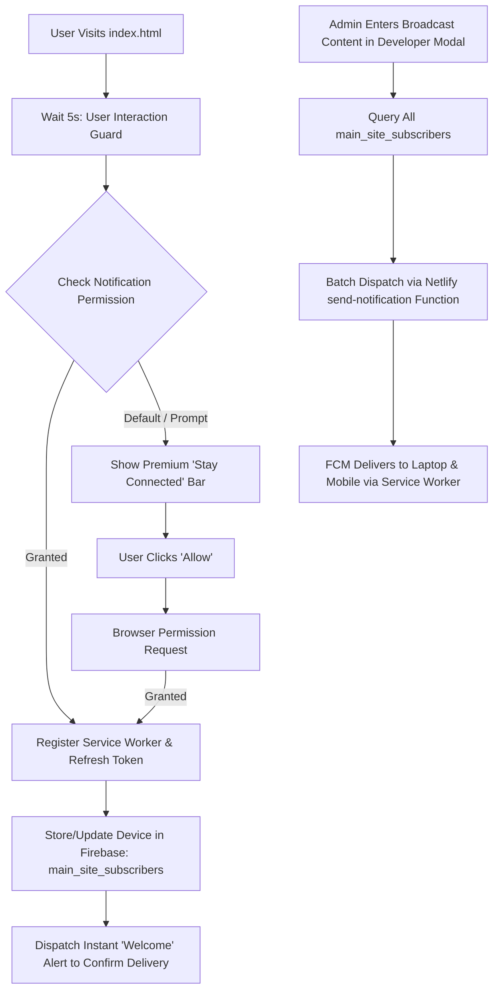

# Flawless Global Push Notification System

Architecture & implementation plan for a simplified, ultra-reliable **Global Push Notification System** that requests permission immediately upon visiting the main site and allows administrators to broadcast to all devices (Laptops & Mobile) with a single click, bypassing any complex site registry requirements.

## Workflow Architecture & System Flowchart

## User Review Required

> [!IMPORTANT]
> **Zero Configuration for Users**:
> - Visitors no longer need to "add a site" or "analyze posts".
> - Permission is requested automatically, and the device token is stored directly in a global subscriber list.

> [!IMPORTANT]
> **Mobile & Laptop Reliability**:
> - Uses a `manifest.json` for full mobile support.
> - Forces token refreshes whenever the user interacts with the page to prevent "NotRegistered" errors.
> - Background processing ensures messages arrive even when the browser is closed.

> [!NOTE]
> **Developer Direct Sending**:
> - The **"Global Push"** tab in the Developer Admin modal is now the single source for creating and publishing independent alerts.

## Proposed Changes

### Push Enrollment Logic

#### [MODIFY] [js/push-notifications.js](file:///C:/Users/suriya%20prakash/OneDrive/Desktop/web/js/push-notifications.js)
- Ensure token registration happens on every visit if permission is granted to keep tokens fresh.
- Add aggressive error recovery for `NotRegistered` FCM errors.

### Admin Broadcast Interface

#### [MODIFY] [js/developer-admin-modal.js](file:///C:/Users/suriya%20prakash/OneDrive/Desktop/web/js/developer-admin-modal.js)
- Refine the **"Global Push"** tab to focus purely on the `main_site_subscribers` collection.
- Ensure the subscriber counter is accurate and updates in real-time.

### Backend Dispatch Function

#### [MODIFY] [netlify/functions/send-notification.js](file:///C:/Users/suriya%20prakash/OneDrive/Desktop/web/netlify/functions/send-notification.js)
- Optimize `sendEach` for large subscriber lists.
- Improve error reporting for failed individual tokens.

---

## Verification Plan

### Automated Verification
- Run `analyze_file` on `js/push-notifications.js`, `js/developer-admin-modal.js`, and `netlify/functions/send-notification.js`.

### Manual Verification
1. Open the site on a new device (Laptop or Mobile).
   - Verify that permission is requested and a "Welcome" alert is received immediately.
2. Log in as Developer and check the subscriber count.
   - Verify that the count incremented.
3. Send a manual broadcast.
   - Verify that both the laptop and mobile device receive the notification simultaneously.
