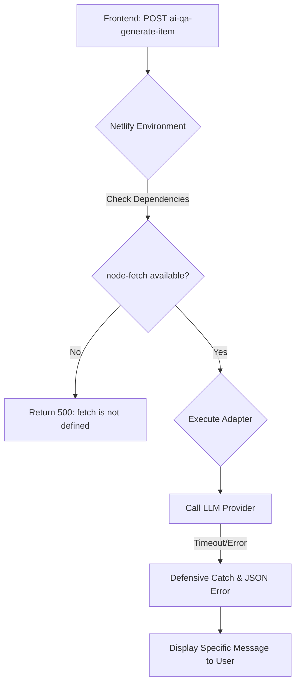

# AI Studio: Backend Stabilization & Dependency Resolution

Implementation plan for resolving the `500 Internal Server Error` in Netlify functions by fixing missing dependencies, improving module resolution, and adding defensive error handling.

## Workflow Architecture (Stabilization)

## User Review Required

> [!IMPORTANT]
> **Dependency Fix**:
> - I am explicitly adding `node-fetch` to all AI adapters. Earlier, I assumed the environment provided a global `fetch`, but in many serverless environments, `node-fetch` must be required explicitly.
> - This is the most likely cause of your `500` errors.

> [!NOTE]
> **Defensive Coding**:
> - I will add checks for `event.body` and JSON parsing to prevent the functions from crashing before they even start.
> - I will also add more logging to help you see the exact error in your browser console if it fails again.

## Proposed Changes

### 1. Provider Adapter Fixes
#### [MODIFY] [netlify/functions/_shared/ai-providers/openai-provider.js](file:///C:/Users/suriya%20prakash/OneDrive/Desktop/web/netlify/functions/_shared/ai-providers/openai-provider.js)
#### [MODIFY] [netlify/functions/_shared/ai-providers/groq-provider.js](file:///C:/Users/suriya%20prakash/OneDrive/Desktop/web/netlify/functions/_shared/ai-providers/groq-provider.js)
- Explicitly `require('node-fetch')`.
- Add validation for API responses.

### 2. Main Function Stabilization
#### [MODIFY] [netlify/functions/ai-qa-generate-item.js](file:///C:/Users/suriya%20prakash/OneDrive/Desktop/web/netlify/functions/ai-qa-generate-item.js)
#### [MODIFY] [netlify/functions/ai-workspace-create.js](file:///C:/Users/suriya%20prakash/OneDrive/Desktop/web/netlify/functions/ai-workspace-create.js)
- Add `try/catch` around JSON parsing of the request body.
- Return detailed error descriptions in the 500 response.

### 3. Frontend Resiliency
#### [MODIFY] [ai-studio/js/workspace.js](file:///C:/Users/suriya%20prakash/OneDrive/Desktop/web/ai-studio/js/workspace.js)
- Add explicit error handling for non-JSON responses (which happen when a server crashes).

---

## Verification Plan

### Manual Verification
1. Open the **AI Studio** and attempt to create a workspace.
2. If it works, try the **Q&A Builder**.
3. If it fails, check the console. You should now see a JSON error message like `{ "error": "fetch is not defined" }` or `{ "error": "Invalid API key" }` instead of a generic HTML 500 page.
